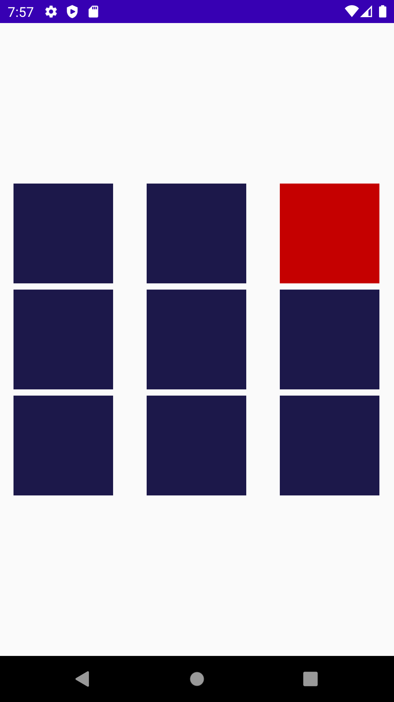

Follow design which is given below 
First screen enter any number 
Any 1 random button should be red color and it should be clickable and other button will be disable and should be gray color check screen-2
Now on click of “red” button from remaining button any 1 random button will become red color and last button will be become green color check screen-3,4
This process will repeat until all button will become green and one button red check screen-5





## Licence
```
Copyright 2022 Naitik Talia

Licensed under the Apache License, Version 2.0 (the "License");
you may not use this file except in compliance with the License.
You may obtain a copy of the License at

    http://www.apache.org/licenses/LICENSE-2.0

Unless required by applicable law or agreed to in writing, software
distributed under the License is distributed on an "AS IS" BASIS,
WITHOUT WARRANTIES OR CONDITIONS OF ANY KIND, either express or implied.
See the License for the specific language governing permissions and
limitations under the License.
```
